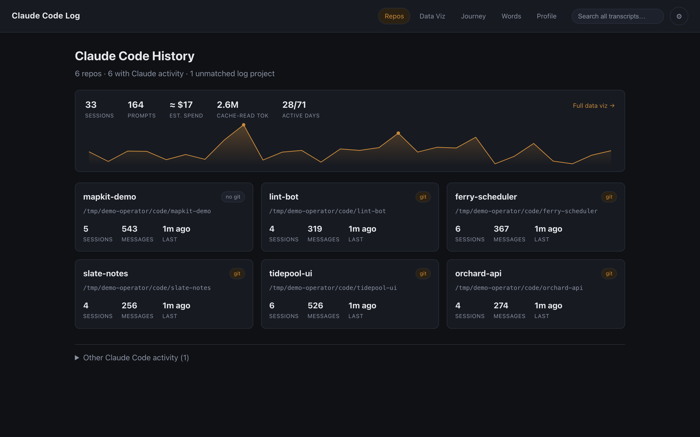
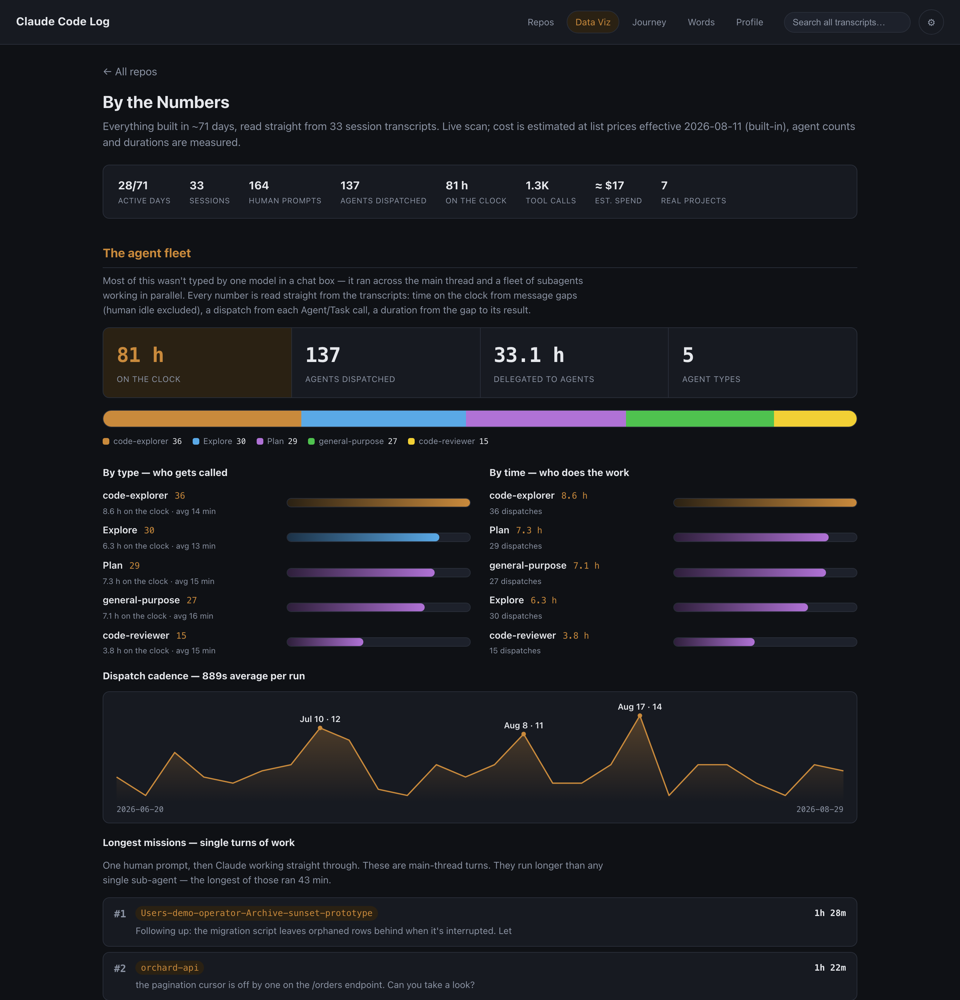
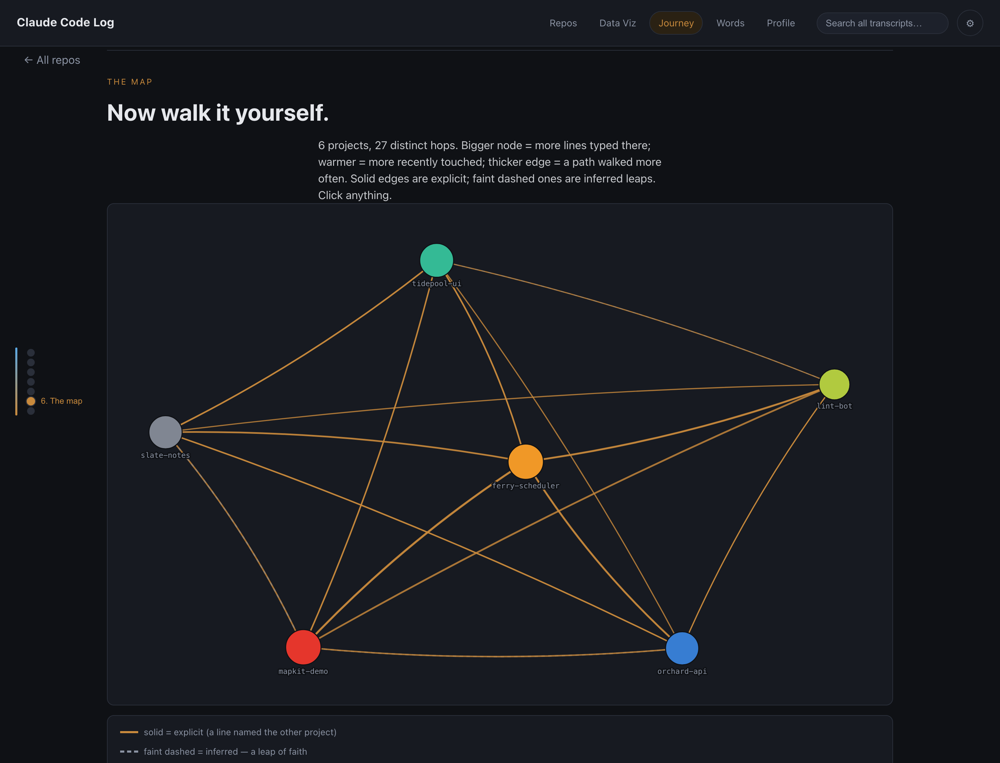
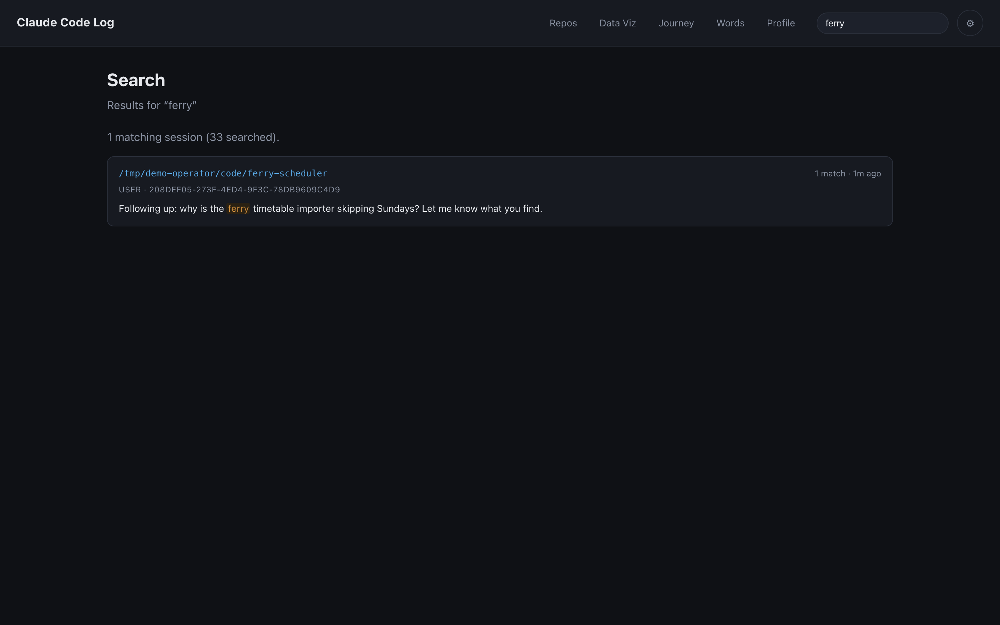
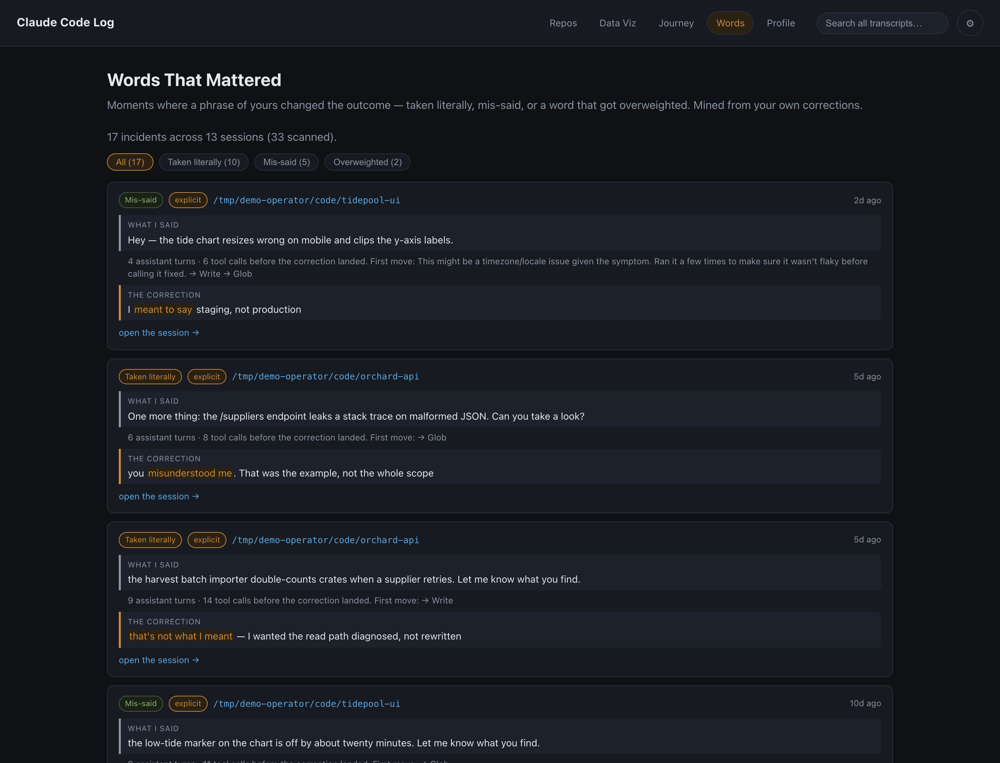
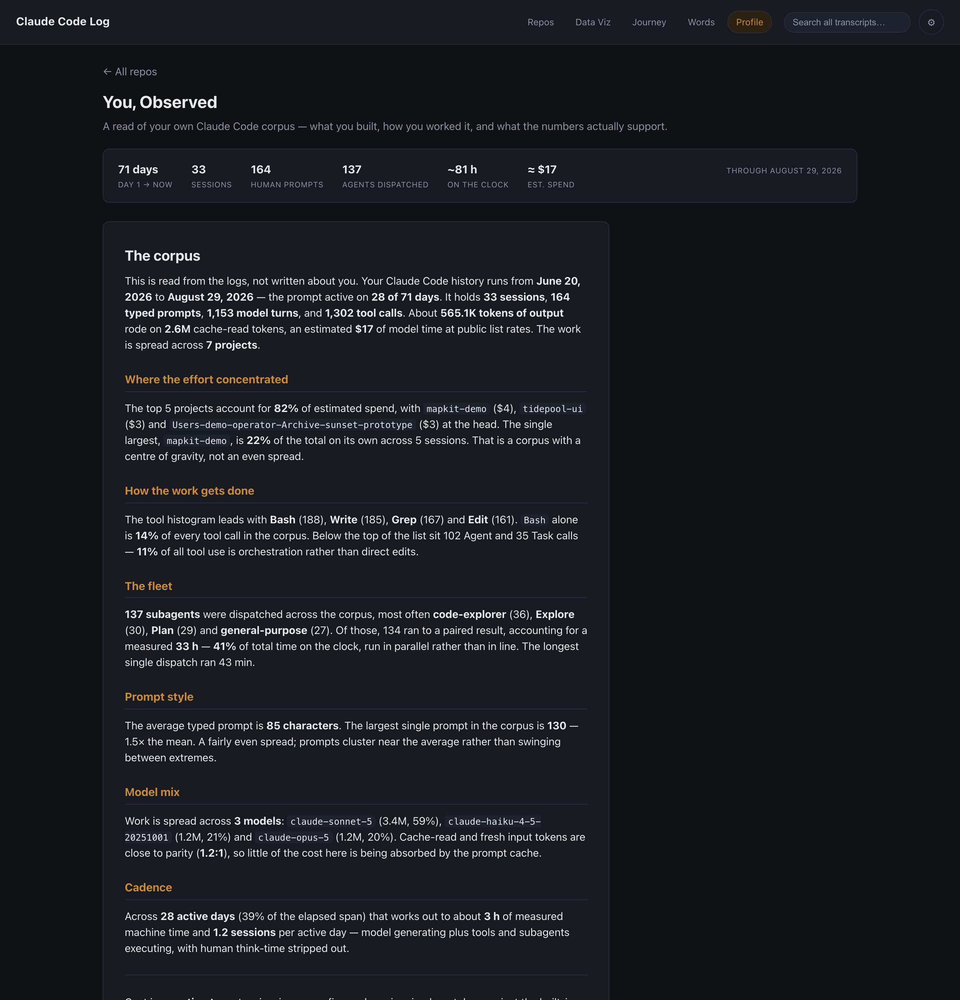

# Claude Code Log

A local dashboard for browsing **and analyzing** your Claude Code history across every repo on your machine.



It scans your Claude Code session logs, crawls your repositories, and joins the two. From there you can drill into any repo to read its project specs (CLAUDE.md, README, manifests, memory index) alongside the parsed transcripts of every session run there — or step back and see the whole corpus at once: spend, token flow, the subagent fleet, and a scroll-driven retelling of the entire journey.

**Everything stays on your machine.** There is no server to sign into, no account, and no telemetry — the app reads local files and renders them in your browser. It binds to loopback only, and its filesystem access is strictly read-only: nothing is ever written to `~/.claude` or to any repo it crawls.

The app itself makes no outbound requests. One thing does reach the network, and it is worth naming: repo specs are rendered as markdown, so a README of yours containing a remote image — a CI badge, say — makes your *browser* fetch that image, exactly as it would on any site. The sanitizer allows `http:`/`https:` in `src`/`href` for that reason. If you would rather nothing leave the machine at all, block remote images in your browser for `127.0.0.1:5189`.

## What this is not

- Not a hosted service and not multi-user — it is a localhost dev tool with no auth, and it should never be exposed off your machine.
- Not a Claude Code plugin, extension, or MCP server. It reads the log files Claude Code already writes; it does not hook into it.
- Not an editor or a session manager. It is strictly read-only — you cannot resume, modify, or delete a session from here.
- Not a billing tool. Cost is **estimated** from token counts at public list rates (see [Model pricing](#model-pricing)); it tracks your real spend closely but it is not an invoice.
- Not affiliated with, endorsed by, or sponsored by Anthropic. "Claude" and "Claude Code" are Anthropic's trademarks; this is an independent third-party tool.

## Requirements

- **Node 24+.** The test runner executes TypeScript sources directly (`node --test test/*.test.ts`), which needs native type-stripping; the screenshot script relies on global `fetch` and `WebSocket`.
- **macOS or Linux.** The `demo` script uses POSIX shell (`$(pwd -P)`, inline env assignment), so on Windows use WSL.
- **Google Chrome** — only for `npm run screenshots`. It defaults to the macOS install path; set `CHROME=/path/to/chrome` to point elsewhere.
- **Something to read.** The app shows you nothing without real Claude Code transcripts under `~/.claude/projects`. If you don't have any — or don't want to look at your own — use `npm run demo`, which generates a synthetic corpus and points the app at it.

## Stack

- **Vite + TypeScript**, vanilla DOM — no UI framework. `marked` renders markdown; everything else is hand-rolled (the charts and the journey particle field are plain SVG/Canvas, no charting library).
- A thin **read-only filesystem API** lives under `server/` (`api.ts` dispatches the routes; `fsScan`, `journey`, `jsonl`, `metrics`, `search`, `words`, and `paths` do the work) and is wired into the Vite **dev and preview** servers as connect middleware (`vite.config.ts`), so the whole app stays **one process**. The browser never touches the filesystem directly; all access goes through `/api/*`.

> **More pictures:** [`docs/overview.html`](docs/overview.html) is a one-page visual overview of the whole app. GitHub serves it as raw source — open the file from a checkout to see it rendered; it needs no server.

## Run

```bash
npm install
npm run dev
```

Opens automatically at **`http://127.0.0.1:5189`**. The port is pinned via `strictPort`, so a collision fails loudly rather than silently drifting onto another port; the host is pinned to loopback, because the API reads your filesystem and has no auth.

### Try it without your own transcripts

```bash
npm run demo
```

That generates a synthetic corpus under `fixtures/` and starts the app pointed at it — six invented repos, 33 sessions, a command history, a subagent fleet, a scatter of corrections for the Words tab to mine, and a deliberate handful of malformed JSONL lines to exercise the skip-gracefully paths. Nothing in it comes from a real machine, so you can screen-share or screenshot the app without publishing your own repo names, prompts, or spend.

The corpus is generated rather than checked in for a structural reason: Claude Code names each log directory after the project's **absolute** path (see [the directory-name encoding](#the-directory-name-encoding)), so a fixture only joins to its repos at the path it was built for. `npm run fixtures` rebuilds it in place; it's deterministic, so repeated runs produce identical content.

`VITE_LOG_DIR` / `VITE_REPO_ROOT` (what `npm run demo` sets) seed the default paths at startup. They're only a seed — anything you've saved in Settings still wins.

## Screenshots

All captured against the sample corpus above, never a real `~/.claude`. Regenerate with two terminals:

```bash
npm run demo:shots        # terminal 1
npm run screenshots:shots # terminal 2
```

Both halves are `:shots` variants because the capture corpus lives under `/tmp/demo-operator`, not `./fixtures`, and the second terminal has to be told where to look. The capture script refuses to run if that corpus isn't readable, or if whatever is answering on the port can't serve it — a stale dev server holding `5189` would otherwise be photographed silently.

Use `demo:shots` rather than `demo` for this: the Repos page renders each repo's **absolute** path on its card, so a corpus built under `./fixtures/` would put the capturing machine's home directory into every committed PNG. `demo:shots` builds the same corpus under `/tmp/demo-operator` instead.

**Data Viz** — corpus analytics computed live, leading with the agent fleet:



**Journey** — the force-directed project graph below the scroll-driven scenes. Node size is lines typed there, warmth is recency; solid edges are explicit switches, faint dashed ones are inferred "leaps of faith":



**Search** — full-text across every transcript, newest-first, with match counts and highlighted snippets:



**Words That Mattered** — corrections mined from your own prompts, paired with the phrase that got taken the wrong way, bucketed and badged by confidence:



**Profile** — a written read of your own corpus, computed live from the same metrics the Data Viz tab uses:



## Search

The top bar has a live, debounced **search box** that full-text-searches every transcript across every project (`#/search`, backed by `GET /api/search`). Results are newest-first, capped at 100 rows, with a match count and a highlighted snippet per session; clicking a result opens a standalone transcript view (`#/session`) with the query still highlighted. Queries under 2 characters are ignored.

There's no on-disk index — the read-only posture rules one out — so a query is still a corpus walk, but it's a cheap one. Enumeration is `readdir`+`stat` only (search never needs the line counts the repo browser computes), each transcript is read once and rejected with a raw-text regex before anything is parsed, and only transcripts that actually match get `JSON.parse`d and cached by mtime+size. Parsing is the dominant cost by a wide margin — on a 2.3 GB corpus it's ~6s against ~1.4s to read the same bytes — so skipping it for the ~95% of files that don't match is where the time goes. A query whose text contains `"`, `\`, a control character, or `→` can't be pre-filtered safely (those differ between the raw JSON and the parsed text), so it transparently falls back to parsing everything.

## Views

Five tabs across the top, plus a per-repo drill-down:

- **Repos** (home) — the front page: every crawled repo as a card (git badge, session/message counts, last activity), sorted by recency. A hero strip summarizes the whole corpus (sessions, prompts, est. spend, cache-read tokens, active days) and links into Data Viz. Log projects that match no crawled repo are collected under **"Other Claude Code activity"**.
- **Data Viz** ("By the Numbers") — the analytics page, computed live from every transcript. It leads with the **agent fleet**: hours on the clock, agents dispatched, time delegated to subagents, a segmented fleet bar, ranked "who gets called" vs. "who does the work" breakdowns by agent type, dispatch cadence, and the longest single main-thread missions. Then pace by day, spend by day, the prompt-cache "iceberg" (log scale), where spend concentrated by project, and a tool-call fingerprint. Cost is estimated at public list prices; agent counts and durations are measured from message timestamps (human idle excluded).
- **Journey** — a scroll-driven ("scrollytelling") retelling of the whole history: a canvas particle field behind pinned scenes that animate day-one → build-up → scale → spread → the subagent-fleet climax, with animated counters and a chapter rail. Below the scenes sits an interactive **map** — a force-directed project graph (node size = lines typed there, warmth = recency; solid edges = explicit switches, faint dashed = inferred "leaps of faith") and a woven timeline of every project visit, all click-to-inspect. This view is reconstructed from `~/.claude/history.jsonl`, which Claude Code writes *next to* its projects directory. A missing history file isn't an error — the API reports it as a degraded state and the tab renders an explicit empty state naming the exact path it looked for, rather than animating a story made of zeros. The other tabs read the transcripts directly and work without it.
- **Words** ("Words That Mattered") — moments where your own phrasing changed the outcome, mined from your corrections (`#/words`, backed by `GET /api/words`). A later user message carrying a correction marker ("that's not what I meant", "typo, I meant…", "I never asked for…") is paired with the nearest earlier substantive prompt — the phrase that got taken the wrong way — with a summary of what the assistant did in between. Entries are bucketed **taken literally / mis-said / overweighted**, and each carries an explicit-vs-inferred confidence badge in the Journey graph's convention: explicit when the correction names the miscommunication outright, inferred when only a weak reversal pattern ("no, …", "wait —") fired. Harness-injected rows (skill expansions, command output, caveats) are filtered out so only typed words qualify.
- **Profile** ("You, Observed") — a written, long-form read of whoever's corpus the app is pointed at, computed live from `GET /api/metrics` on every load. Nothing in it is hardcoded: the stat strip and every figure in the prose are derived from the transcripts under the configured log dir. Sections drop out entirely when the signal that would justify them is absent — no subagents dispatched means no fleet section — so a thin corpus renders a short honest page rather than a padded one. It states what the numbers support and stops there; it does not render a verdict on the person who typed them.
- **Repo detail** (click any repo card) — the original browse view: project specs (CLAUDE.md, README, package/pyproject manifests, and the repo's Claude Code `memory/MEMORY.md` index) rendered alongside every session transcript for that repo, each expandable into its parsed user/assistant/tool timeline. The detected stack shows as chips.

## Live refresh

A long-lived tab re-scans the logs on a quiet **5-minute interval** (`src/main.ts`): it drops the cached metrics/journey scans and re-renders the current view, no manual reload. This is plain polling, not a push/filesystem-watch.

The router asks for scroll to be preserved across that refresh, and the repo page manages it — it keeps the old render up while refetching. The analytics views do not: they clear their host and show a loading line first, so the document collapses and the browser clamps scroll to the top. On those pages a refresh will move you.

## API surface

Every route is read-only, JSON, and served under `/api/` by `server/api.ts`:

- `GET /api/health` — liveness probe
- `GET /api/overview?logDir&repoRoot` — repo cards + orphan log projects
- `GET /api/repo?logDir&repoRoot&path&name` — one repo's specs + session list
- `GET /api/session?logDir&file[&limit]` — a single parsed transcript, capped at 60 MB read / 5000 events (`truncated` + honest totals in the payload; `limit` can only lower the event cap)
- `GET /api/metrics?logDir[&repoRoot]` — the whole-corpus rollup (Data Viz). `repoRoot` is optional and only sharpens project names (see [the directory-name encoding](#the-directory-name-encoding))
- `GET /api/journey?logDir&days` — the project graph + visit timeline (Journey)
- `GET /api/search?logDir&q[&repoRoot]` — full-text search across every transcript, newest-first, capped at 100 results
- `GET /api/words?logDir[&repoRoot]` — correction mining for the Words tab, newest-first, capped at 200 entries

`logDir` and `repoRoot` are validated on every route that takes them; see [Security posture](#security-posture).

## Configuration

Click the **⚙ gear** in the top bar. Two paths, persisted to `localStorage`, seeded with defaults:

- **Claude Code log location** — default `~/.claude/projects`
- **Base repo root** — default `~/Projects`

`~` and `$HOME` are expanded server-side. "Save & rescan" drops the caches and reloads the view against the new paths.

### The directory-name encoding

Claude Code stores one directory per project under the log location. The directory name is the project's **absolute path with every `/` replaced by `-`** — e.g. `/Users/me/Projects/app` → `-Users-me-Projects-app`. Each directory holds `*.jsonl` session transcripts (one JSON object per line) and may contain a `memory/` subdirectory.

Decoding a directory name back to a path is **ambiguous** (a path segment can itself contain `-`, so `-Users-me-code-mapkit-demo` splits just as plausibly into `.../mapkit/demo`). So nothing is ever recovered by decoding. Instead every path the app already knows to be real — each crawled repo, the configured repo root, your home directory — is *encoded* and matched against the directory name, which is lossless in that direction. That is why the routes above take an optional `repoRoot`: with it, a project is named exactly what the repo crawl calls it; without it, the name falls back to a longer path fragment rather than a guess.

This is why project names are never abbreviated by chopping at a dash. A verbose name is imprecise; a truncated one is wrong. Log projects that match no crawled repo are listed separately under "Other Claude Code activity", and those are the one place a best-effort decoded path is still shown — there is no real path left to match them against.

## Copy embed prompt

The Settings panel has a **Copy embed prompt** button. It copies a prompt you can paste into Claude Code **inside any other project**: it recreates this dashboard there, but instructs the agent to detect and conform to *that project's* existing framework, routing, and styling instead of this app's vanilla/Vite stack.

## Model pricing

Spend is estimated from per-message token usage priced at public list rates. Those rates change, so they aren't buried in the source: the built-in table lives in `server/pricing.ts` with the date it reflects, and either of two overrides wins over it —

- a `pricing.json` at the repo root (gitignored, it's operator-local), or
- `CLAUDE_CODE_LOG_PRICING=/path/to/rates.json`.

Copy `pricing.example.json` to start. Rates are keyed by model family — `fable` (Fable/Mythos 5), `opus` (Opus 4.5+ and Opus 5), `opus-legacy` (pre-4.5 Opus, so old transcripts still price at what those models actually cost), `sonnet`, `haiku`. Every field is optional, so a file that only sets `opus` overrides only opus; a malformed or unreadable file falls back to the built-in table rather than failing. The table is read once per process, so editing it needs a server restart. The Data Viz caption names which source and effective date produced the numbers you're looking at, so a stale table is visible rather than silent.

## Security posture

This is a localhost tool with no auth that reads the filesystem, so the boundaries are explicit rather than incidental:

- **Loopback only.** Both the dev and preview servers are pinned to `127.0.0.1` in `vite.config.ts`, not left to Vite's default.
- **Contained roots.** `logDir` and `repoRoot` arrive from the client (they're settings in `localStorage`), so every route validates them: a root outside `$HOME` gets a 400 instead of a directory listing. `CLAUDE_CODE_LOG_ROOTS` (colon-separated) adds roots if you keep repos on another volume.
- **Contained paths.** The two routes that additionally take a file path check it against the root they were given — and follow symlinks while doing it, so a link inside the root that points outside it is rejected rather than read.
- **No cross-origin reads.** CORS is pinned **off** on both the dev and preview servers in `vite.config.ts`, so no `Access-Control-Allow-Origin` header is emitted on any route, including preflight — a page on another origin can issue a request but cannot read the response. This is an explicit pin, not a default: Vite reflects *any* `localhost`/`127.0.0.1` origin back by default, which would let a page served by any other local dev server read your whole corpus. Verified by request, not by assumption.
- **Loopback `Host` gate.** `/api/*` rejects any request whose `Host` isn't `127.0.0.1`, `localhost`, or `[::1]` with a **403**. This is not redundant with binding to loopback: the API is connect middleware installed in `configureServer`/`configurePreviewServer`, which Vite runs *before* its own DNS-rebinding host check, so that check never covers these routes. Without the gate, a page that rebinds its own hostname to `127.0.0.1:5189` would read the whole transcript corpus as same-origin.
- **Read-only verbs.** Every route is a read, so the middleware enforces it: anything other than `GET`/`HEAD` gets a **405** with an `Allow` header rather than falling through to the same handlers. Responses carry `X-Content-Type-Options: nosniff`.
- **Sanitized markdown.** Spec files from crawled repos are rendered as HTML, so that HTML is parsed and stripped to an inert subset first (`src/sanitize.ts`): dangerous elements dropped with their subtrees, attributes reduced to an allowlist — which kills every `on*` handler by construction rather than by blocklist — and `href`/`src` limited to `http:`/`https:`/`mailto:` and relative URLs.

## Notes & constraints

- Filesystem access is strictly **read-only**; nothing is written to `~/.claude` or any crawled repo.
- Missing/permission-denied paths and malformed JSONL lines are skipped gracefully.
- The repo crawl lists every directory directly under the base root, plus git repos nested one level deeper (e.g. `~/Projects/org/repo`).

## Build

```bash
npm run build && npm run preview
```

`preview` serves the built app plus the same read-only `/api/*` middleware.

## Development

```bash
npm test        # unit + regression suite (node:test, no framework)
npm run typecheck
```

`npm run build` runs the typecheck before bundling, so a type error fails the build rather than shipping.

## Contributing

Issues and pull requests are welcome. There's no formal process: open an issue
describing what you hit, or send a PR with `npm run typecheck`, `npm test`, and
`npm run build` green — CI runs those three on Node 24, plus `npm audit --omit=dev`
(production dependencies must be free of high-severity advisories).

This is a personal tool published because it might be useful, not a project
seeking maintainers, so responses may be slow and features outside the read-only
local-first posture described above are likely to be declined.

## License

MIT — see [LICENSE](LICENSE). Copyright (c) 2026 Justin Higgins.
